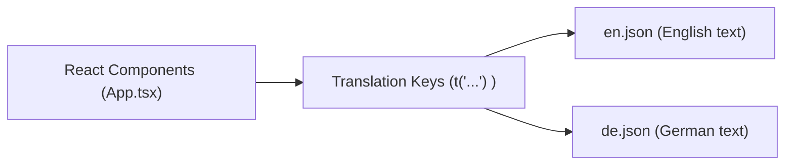

# Content Customization Guide

## 1. Introduction

This guide explains **how to customize the text** of the landing page:

- Change titles and body text in the center circle.
- Change labels, tooltips, and modal text for squares.
- Keep both English and German translations in sync.

You do **not** need to touch complex React code for basic text changes.

---

## 2. Where the Text Lives

Most visible text is stored in **translation JSON files**:

- English: `src/locales/en.json`
- German: `src/locales/de.json`

The React code uses keys like `outerSquares.1.label`. Each language file provides values for the same keys.



If you only edit `en.json`, the German version will still work but show old text.

---

## 3. Customizing Inner Square Topics

Inner squares are **6, 7, 10, 11**.

### Files

- `src/locales/en.json`
- `src/locales/de.json`

### Keys

- `innerSquares.6.topic` → Infrastructure topic
- `innerSquares.7.topic` → Projects topic
- `innerSquares.10.topic` → Miscellaneous topic
- `innerSquares.11.topic` → Documentation topic

### Steps

1. Open `src/locales/en.json`.
2. Find the `innerSquares` section.
3. Change the `topic` values to your desired English text.
4. Repeat the same key changes in `src/locales/de.json` with German text.

---

## 4. Customizing Outer Square Labels & Modals

Each outer square has:

- `label` → short text shown in the square.
- `tooltipTitle` → text shown when hovering.
- `modalBody` → paragraph text shown inside the modal.

### Files

- `src/locales/en.json`
- `src/locales/de.json`

### Keys Pattern

For a square with number `X` (e.g., `1`, `2`, `3`, ...):

- `outerSquares.X.label`
- `outerSquares.X.tooltipTitle`
- `outerSquares.X.modalBody`

### Steps

1. Open `src/locales/en.json`.
2. Search for `"outerSquares"`.
3. Find the entry for the square number you want (e.g., `"1"`, `"2"`).
4. Edit `label`, `tooltipTitle`, and `modalBody` as needed.
5. Repeat the same updates in `src/locales/de.json` with German translations.

Tip: For long modal texts, you can use full paragraphs. Line breaks (`\n`) in JSON will be rendered as new paragraphs where supported.

---

## 5. Customizing Center Circle Text

The center circle cycles through **states** such as `poem-intro`, `tech-stack`, `projects`, and `random-page`.

### Files

- `src/locales/en.json`
- `src/locales/de.json`

### Keys

- `centerCircle.states.poem-intro.title`
- `centerCircle.states.poem-intro.description`
- `centerCircle.states.tech-stack.title`
- `centerCircle.states.tech-stack.description`
- `centerCircle.states.projects.title`
- `centerCircle.states.random-page.title`

### Steps

1. Open `src/locales/en.json`.
2. Search for `"centerCircle"`.
3. Under `states`, edit `title` and `description` values.
4. For multi-paragraph content, you can include `\n` within the string.
5. Repeat the same key changes in `src/locales/de.json`.

---

## 6. Customizing Project & Link Names

When the `projects` or `random-page` state is active, the modal shows links:

- **Projects** come from `centerCircle.projects`.
- **External links** come from `centerCircle.links`.

### Files

- `src/locales/en.json`
- `src/locales/de.json`

### Keys

- `centerCircle.projects.food-shop`
- `centerCircle.projects.landing-page`
- `centerCircle.links.github`
- `centerCircle.links.tulamia`

### Steps

1. Open `src/locales/en.json`.
2. Edit the values under `centerCircle.projects` and `centerCircle.links`.
3. Repeat the same keys in `src/locales/de.json`.

**Note:** The actual URLs for these links are defined in code (`src/App.tsx` inside `centerCircleData`). If you want to change the URLs, adjust them in `App.tsx`. The texts (labels) live in the JSON files.

---

## 7. Page Title and Metadata

The browser tab title usually comes from `index.html` (or a similar HTML template). In a standard Vite React app:

- File: `index.html` in the project root.
- Look for the `<title>...</title>` tag.

### Steps

1. Open `index.html`.
2. Edit the `<title>` content.
3. Optionally update meta tags like description if present.

This affects what appears in the browser tab and search results.

---

## 8. After Changing Text

After you edit any JSON or HTML file:

- If the dev server is running (`npm run dev`), it should hot-reload automatically.
- If not running, start it:

```bash
npm install
npm run dev
```

For production deployment:

```bash
npm run build
# then either
npm run deploy          # Manual deploy (gh-pages)
# or push to master to trigger GitHub Actions
```

Make sure there are **no JSON syntax errors** (missing commas, quotes, or braces), or the app will fail to start.
