# Deployment Guide: React to GitHub Pages

## 1. Introduction
**The Problem:** We built a React application locally, but it was only visible on our own computer. We needed a way to publish it to the internet so others can see and use it.

**Why this matters:** Deployment is the final step in software development. Without it, the application remains a prototype in a development environment. We chose **GitHub Pages** because it is free, integrated with our code repository, and perfect for static sites like this one.

## 2. Solution Overview
We implemented an automated deployment pipeline using the `gh-pages` tool.

**Key Decisions:**
*   **Tooling:** We used the `gh-pages` npm package instead of manual git commands. This reduces human error and simplifies the process to a single command.
*   **Configuration:** We modified `vite.config.ts` to set the correct `base` path. This is critical because GitHub Pages hosts project sites at `https://user.github.io/repo-name/`, not at the root domain.

## 3. Workflow & Component Interaction
The deployment process involves several "players" working together to move code from your local machine to the live internet.

### The Deployment Flow

```mermaid
flowchart LR
    subgraph Local["💻 Your Local Computer"]
        direction TB
        Source["📂 src/ folder\n(Your Code)"]

        subgraph Step1["1. Build Phase"]
            BuildCmd["npm run build"]
            Vite["⚙️ Vite\n(The Builder)"]
        end

        Dist["📦 dist/ folder\n(Ready-to-ship Website)"]

        subgraph Step2["2. Deploy Phase"]
            DeployCmd["npm run deploy"]
            GHPagesPkg["🚚 gh-pages tool\n(The Courier)"]
        end
    end

    subgraph Remote["☁️ GitHub (The Cloud)"]
        Repo["Your Repository"]
        Branch["🌿 gh-pages branch\n(Special Website Branch)"]
        Website["🌍 Internet\n(Live Site)"]
    end

    %% The Flow
    Source --> BuildCmd
    BuildCmd -- "Calls" --> Vite
    Vite -- "Compiles into" --> Dist

    Dist --> DeployCmd
    DeployCmd -- "Calls" --> GHPagesPkg

    GHPagesPkg -- "🚀 UPLOADS ONLY DIST" --> Branch
    Branch -- "Auto-Publishes" --> Website

    %% Styling
    style Local fill:#e1f5fe,stroke:#01579b,stroke-width:2px
    style Remote fill:#f3e5f5,stroke:#4a148c,stroke-width:2px
    style Dist fill:#fff9c4,stroke:#fbc02d,stroke-width:2px,stroke-dasharray: 5 5
    style GHPagesPkg fill:#ffccbc,stroke:#bf360c,stroke-width:2px
```

### How it works:
1.  **Build**: `npm run build` tells Vite to compile your code into the `dist` folder.
2.  **Deploy**: `npm run deploy` tells the `gh-pages` tool to take *only* that `dist` folder and upload it to a specific branch on GitHub.
3.  **Publish**: GitHub detects the update to the `gh-pages` branch and updates the live website.

## 4. Lessons Learned
*   **The "Invisible" Branch**: The `gh-pages` branch is created and managed remotely. You might not see it in your local `git branch` list, and that is normal. The `gh-pages` tool acts as a courier that delivers directly to the remote server.
*   **Base Path Importance**: If the site loads but is blank or missing styles, it is usually because the `base` path in `vite.config.ts` was not set to match the repository name.

## 5. References
*   [Vite Documentation: Deploying to GitHub Pages](https://vitejs.dev/guide/static-deploy.html#github-pages)
*   [gh-pages npm package](https://www.npmjs.com/package/gh-pages)
