```mermaid
flowchart LR
    subgraph Local["💻 Local"]
        Code["Your Code"]
    end

    subgraph GitHub["☁️ GitHub"]
        Push["git push master"]
        Actions["⚙️ GitHub Actions"]
        Pages["🌍 GitHub Pages"]
    end

    Code --> Push
    Push --> Actions
    Actions -- "Build & Deploy" --> Pages

    style Local fill:#e1f5fe,stroke:#01579b,stroke-width:2px
    style GitHub fill:#f3e5f5,stroke:#4a148c,stroke-width:2px
    style Actions fill:#fff9c4,stroke:#fbc02d,stroke-width:2px
```

```mermaid
flowchart LR
    subgraph Local["💻 Your Local Computer"]
        direction TB
        Source["📂 src/ folder"]

        subgraph Build["1. Build"]
            BuildCmd["npm run build"]
            Vite["⚙️ Vite"]
        end

        Dist["📦 dist/ folder"]

        subgraph Deploy["2. Deploy"]
            DeployCmd["npm run deploy"]
            GHPagesPkg["🚚 gh-pages tool"]
        end
    end

    subgraph Remote["☁️ GitHub"]
        Branch["🌿 gh-pages branch"]
        Website["🌍 Live Site"]
    end

    Source --> BuildCmd
    BuildCmd --> Vite
    Vite --> Dist
    Dist --> DeployCmd
    DeployCmd --> GHPagesPkg
    GHPagesPkg -- "Uploads dist/" --> Branch
    Branch --> Website

    style Local fill:#e1f5fe,stroke:#01579b,stroke-width:2px
    style Remote fill:#f3e5f5,stroke:#4a148c,stroke-width:2px
    style Dist fill:#fff9c4,stroke:#fbc02d,stroke-width:2px,stroke-dasharray: 5 5
    style GHPagesPkg fill:#ffccbc,stroke:#bf360c,stroke-width:2px
```

# Deployment Guide: React to GitHub Pages

## Introduction

**The Problem:** We built a React application locally, but it was only visible on our own computer. We needed a way to publish it to the internet.

**Why GitHub Pages?** It is free, integrated with our code repository, and perfect for static sites.

**Prerequisite:** Set the correct `base` path in `vite.config.ts` to match your repository name:

```ts
// vite.config.ts
export default defineConfig({
  base: '/landing-page/',  // Must match your repo name
  plugins: [react()],
})
```

---

## Method 1: GitHub Actions (Recommended)

This is the **recommended approach**. Every push to `master` automatically builds and deploys your app—no manual steps required.

### How It Works



### Setup Steps

**Step 1:** Create the workflow file at `.github/workflows/deploy.yml`:

```yaml
name: Deploy to GitHub Pages

on:
  push:
    branches: ['master']
  workflow_dispatch:

permissions:
  contents: read
  pages: write
  id-token: write

concurrency:
  group: 'pages'
  cancel-in-progress: true

jobs:
  deploy:
    environment:
      name: github-pages
      url: ${{ steps.deployment.outputs.page_url }}
    runs-on: ubuntu-latest
    steps:
      - uses: actions/checkout@v5

      - uses: actions/setup-node@v4
        with:
          node-version: lts/*
          cache: 'npm'

      - run: npm ci
      - run: npm run build

      - uses: actions/configure-pages@v5
      - uses: actions/upload-pages-artifact@v3
        with:
          path: './dist'

      - id: deployment
        uses: actions/deploy-pages@v4
```

**Step 2:** Configure GitHub Pages source:
1. Go to **Settings → Pages**
2. Under **Build and deployment → Source**, select **GitHub Actions**

**Step 3:** Push your changes:

```bash
git add .github/workflows/deploy.yml
git commit -m "[CONFIG] Add GitHub Actions workflow for Pages deployment"
git push origin master
```

### Usage

After setup, deployment is fully automatic:

```bash
# Make changes, commit, and push
git add .
git commit -m "[FEATURE] Add new feature"
git push origin master
# ✅ GitHub Actions builds and deploys automatically
```

---

## Method 2: Manual Deploy with gh-pages Tool

An alternative approach using the `gh-pages` npm package. Useful when you want manual control over deployments.

### How It Works



### Setup Steps

**Step 1:** Install the gh-pages package:

```bash
npm install --save-dev gh-pages
```

**Step 2:** Add deploy script to `package.json`:

```json
{
  "scripts": {
    "deploy": "gh-pages -d dist"
  }
}
```

**Step 3:** Configure GitHub Pages source:
1. Go to **Settings → Pages**
2. Under **Build and deployment → Source**, select **Deploy from a branch**
3. Select branch: `gh-pages`, folder: `/ (root)`

### Usage

```bash
# Build the app
npm run build

# Deploy to GitHub Pages
npm run deploy
```

### Key Points

- **Invisible Branch:** The `gh-pages` branch is created remotely. You may not see it locally—this is normal.
- **Two-Step Process:** You must run `npm run build` before `npm run deploy`.

---

## Lessons Learned

- **Base Path is Critical:** If the site loads blank or missing styles, check that `base` in `vite.config.ts` matches your repository name.
- **GitHub Actions is Simpler:** Once set up, you never need to think about deployment again—just push and it deploys.
- **gh-pages for Control:** Use the manual method when you need to deploy specific builds or test before going live.

---

## References

- [Vite: Deploying to GitHub Pages](https://vitejs.dev/guide/static-deploy.html#github-pages)
- [GitHub Actions: deploy-pages](https://github.com/actions/deploy-pages)
- [gh-pages npm package](https://www.npmjs.com/package/gh-pages)
