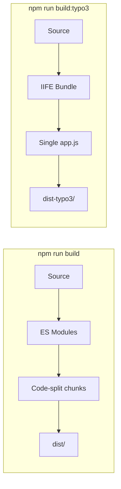

# Developer Guide

Quick reference for developing, building, and deploying this app.

---

## NPM Scripts

| Command | Purpose | Output |
|---------|---------|--------|
| `npm run dev` | Development server | localhost:5173 |
| `npm run build` | Build for GitHub Pages | `dist/` |
| `npm run build:typo3` | Build for TYPO3 | `dist-typo3/` |
| `npm run deploy` | Build & deploy to GitHub Pages | Live site |

---

## Development Workflow

### Start Development

```bash
npm run dev
```

Opens at `http://localhost:5173/landing-page/` with hot reload.

### Deploy to GitHub Pages

```bash
npm run deploy
```

This builds and publishes to `https://tulamia311.github.io/landing-page/`.

### Build for TYPO3

```bash
npm run build:typo3
```

Creates single `app.js` + `app.css` in `dist-typo3/` for TYPO3 import.

---

## Build Differences



| Aspect | GitHub Pages | TYPO3 |
|--------|--------------|-------|
| Format | ES modules | IIFE |
| Files | Multiple chunks | Single bundle |
| Base path | `/landing-page/` | `./` (relative) |

---

## Project Structure

```
landing-page/
├── src/
│   ├── components/     # React components
│   ├── pages/          # Page components
│   ├── config/         # App configuration
│   ├── styles/         # CSS files
│   ├── locales/        # Bundled translations (fallback)
│   └── main.tsx        # Entry point
├── public/
│   └── locales/        # Runtime translations
├── docs/               # Documentation (shown in Wiki)
├── dist/               # GitHub Pages build
└── dist-typo3/         # TYPO3 build
```

---

## Adding New Features

1. Create component in `src/components/`
2. Use `lp-` prefix for CSS classes
3. Add translations to `public/locales/*.json`
4. Test with `npm run dev`
5. Deploy with `npm run deploy`
