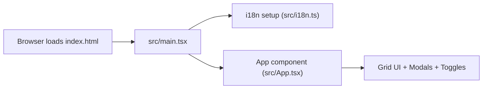

# Technical Overview: Landing Page

## 1. Introduction

This document describes the **technologies used** in the landing page and highlights **critical technical points** that matter for development and deployment.

---

## 2. Main Technologies

- **React + TypeScript**
  - Core UI is built with React function components.
  - TypeScript adds static typing for safer refactors.

- **Vite**
  - Development server with fast HMR.
  - Bundles the app for production into `dist/`.
  - Configured with `base: '/landing-page/'` for GitHub Pages.

- **i18next + react-i18next**
  - Handles translations and language switching.
  - Uses JSON files (`en.json`, `de.json`) as the single source of truth for UI text.

- **i18next-browser-languagedetector**
  - Tries to detect the user's preferred language from the browser and use it as a default.

- **CSS (index.css + App.css)**
  - Implements the 4x4 grid layout.
  - Controls blurred/visible states of squares.
  - Handles dark mode styling via a `dark-mode` class on `body`.

- **gh-pages + GitHub Actions**
  - `gh-pages` npm package supports manual deployments (Method 2).
  - GitHub Actions workflow handles automatic deployment to GitHub Pages (Method 1).

---

## 3. Application Entry & Initialization

- `src/main.tsx` is the **entry point**:
  - Imports `./i18n` (initializes translations).
  - Imports `./index.css` (global styles).
  - Renders `App` into the `root` DOM element.

---

## 4. State & Interaction Logic (App Component)

Key responsibilities of `src/App.tsx`:

- **Language handling**
  - Uses `useTranslation()` from `react-i18next`.
  - Renders `EN` / `DE` buttons to call `i18n.changeLanguage('en' | 'de')`.

- **Grid behavior**
  - Manages which **group** (inner square) is hovered or toggled.
  - Computes CSS class names so outer squares become **visible or blurred**.

- **Center circle behavior**
  - Picks a random **Luffy state** from a list of IDs.
  - Shows a tooltip with the current state's title.
  - Opens a modal with detailed content on click.

- **Outer square behavior**
  - Shows labels for all outer squares.
  - Shows tooltips and modals only when the outer square is **visible**.

State is managed purely in React using `useState`, with no external state management library.

---

## 5. Theming (Dark / Light Mode)

The component `src/components/ThemeToggle.tsx` is responsible for theme switching.

- Uses `useState` to track `isDark`.
- Reads initial value from:
  - `localStorage` key `landing-page-theme`, or
  - Browser `prefers-color-scheme: dark` preference.
- Writes the current mode back to `localStorage` so the choice persists.
- Toggles a `dark-mode` class on `document.body` which CSS uses to switch colors.

**Critical point:** If you rename the localStorage key or body class, also update the CSS.

---

## 6. Translations & Text Structure

Text is not hard-coded in components. Instead, the app uses **translation keys**.

- Translation setup: `src/i18n.ts`
- English text: `src/locales/en.json`
- German text: `src/locales/de.json`

Structure of important keys:

- `innerSquares.{id}.topic` → label for inner squares 6, 7, 10, 11
- `outerSquares.{id}.label` → small label inside each outer square
- `outerSquares.{id}.tooltipTitle` → title in tooltip and modal
- `outerSquares.{id}.modalBody` → body text inside modal
- `centerCircle.states.{id}.title` → title text in center circle tooltip and modal
- `centerCircle.states.{id}.description` → long text for some states
- `centerCircle.projects.{key}` → link labels for project list
- `centerCircle.links.{key}` → link labels for external links

**Critical point:** Always keep **keys** in sync across all languages. If you add a new key in `en.json`, also add it in `de.json`.

---

## 7. Build & Deployment

- **Build command**: `npm run build`
  - Runs TypeScript build (`tsc -b`).
  - Runs `vite build` and outputs to `dist/`.

- **Manual deploy (gh-pages)**: `npm run deploy`
  - Uses `gh-pages -d dist` to push built files to the `gh-pages` branch.

- **Automatic deploy (GitHub Actions)**:
  - Workflow: `.github/workflows/deploy.yml`.
  - Trigger: push to `master` or manual dispatch.
  - Steps:
    - Install dependencies (`npm ci`).
    - Build (`npm run build`).
    - Upload `dist/` as artifact.
    - Deploy to GitHub Pages.

**Critical point:** Vite's `base` option in `vite.config.ts` **must** match the GitHub Pages path (`/landing-page/`) or assets will break.
