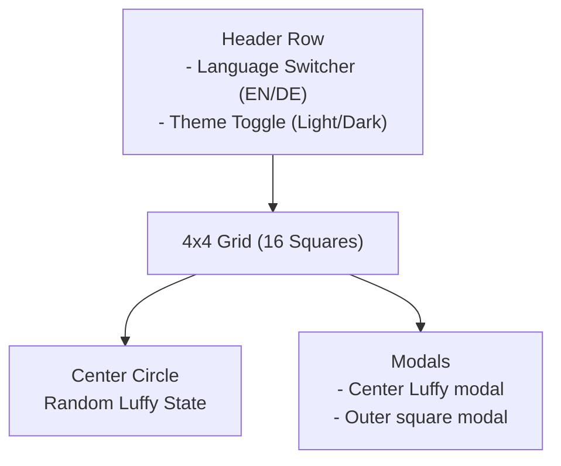

# UI Overview: Landing Page Grid

## 1. Introduction

This document explains **how the frontend UI works** and **what text is displayed** so that you can understand the behavior before changing anything.

The page is a **16-square interactive grid** with a **center circle** and **two utility controls**:

- Language switcher (EN / DE)
- Theme toggle (light / dark)

All user-facing text is loaded via **i18n JSON files** so it can be translated.

---

## 2. Layout Overview

At a high level, the layout looks like this:

- The **header row** shows the language buttons and theme toggle.
- The **grid** holds 16 squares (`square-1` to `square-16`).
- The **center circle** in the middle triggers a random **Luffy state** with title and body text.
- **Modals** and **tooltips** display more detailed text when you click or hover.

---

## 3. Inner vs Outer Squares

There are two types of squares:

- **Inner squares**: 6, 7, 10, 11
- **Outer squares**: all other squares (1, 2, 3, 4, 5, 8, 9, 12, 13, 14, 15, 16)

### Inner Squares (6, 7, 10, 11)

- Represent **topics**:
  - 6 → Infrastructure
  - 7 → Projects
  - 10 → Miscellaneous
  - 11 → Documentation
- Each inner square:
  - Has a **background icon** (from `index.css`)
  - Has a **topic text** from translations (`innerSquares.{id}.topic`)
  - Controls visibility of a **group** of outer squares on hover and toggle.

### Outer Squares (all others)

- Each outer square has:
  - A **label** (`outerSquares.{id}.label`)
  - A **tooltip title** (`outerSquares.{id}.tooltipTitle`)
  - A **modal body text** (`outerSquares.{id}.modalBody`)
- By default, many outer squares are **blurred**.
- When you **hover over** or **toggle** an inner square, the related outer squares become visible.

---

## 4. Center Circle & Luffy States

The center circle shows a random **Luffy state** when you hover or click.

There are several possible states (IDs):

- `poem-intro`
- `tech-stack`
- `projects`
- `random-page`

Each state has:

- `centerCircle.states.{id}.title`
- `centerCircle.states.{id}.description` (optional, multi-line)

When you **click** the center circle:

- A modal opens with the current state.
- For `tech-stack`, the modal shows a long description explaining the stack.
- For `projects`, the modal lists project links using `centerCircle.projects.{key}`.
- For `random-page`, the modal lists random links using `centerCircle.links.{key}`.

---

## 5. Language Switcher

The top-left of the header row shows two buttons:

- `EN` → switches language to English (`en`)
- `DE` → switches language to German (`de`)

Internally, this calls the i18n library to change the active language. All text on the page updates immediately using the **same keys** but different JSON files.

---

## 6. Theme Toggle

The theme toggle is a button with a **sun** or **moon** icon.

- When clicked, it toggles **dark mode** on or off.
- It remembers the choice in `localStorage` under the key `landing-page-theme`.
- CSS (`index.css`) uses the `dark-mode` class on the `body` element to switch colors.

---

## 7. Where the Text Comes From (High Level)

All user-visible text is stored in JSON translation files:

- English: `src/locales/en.json`
- German: `src/locales/de.json`

The React code calls the translation function `t(...)` with keys like:

- `innerSquares.6.topic`
- `outerSquares.1.label`
- `centerCircle.states.poem-intro.title`

These keys are **shared** across all languages, so the UI behavior stays identical while the text changes.
